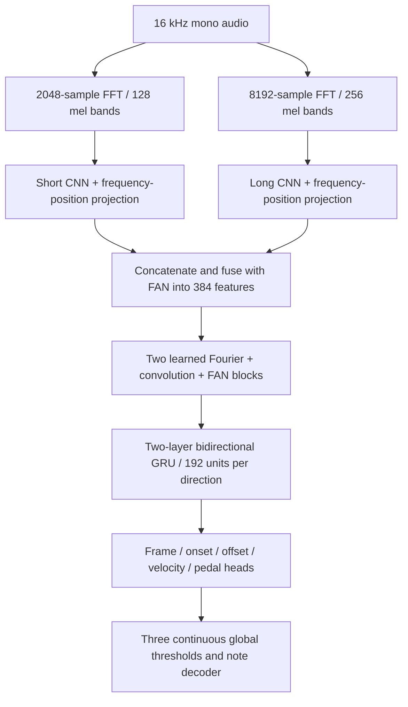

# Piano note and chord recognition with PyTorch

This project learns **piano note events** from audio with PyTorch. Version 8 (`onsets-fourier-recurrent`) combines Fourier Analysis Network (FAN) layers, convolutional encoders, trainable Fourier mixing, and a bidirectional GRU. It predicts note starts, held keys, releases, velocity, and sustain pedal for 88 keys (MIDI 21–108) every 20 ms. Simultaneous pitch classes are matched to common triads and seventh chords.

Version 8 has **10,012,924 trainable parameters**, keeps gradient descent for three global thresholds, and emphasizes bass and treble training examples. Best-model selection uses the equally weighted average of per-key **F0, F1, F2 and F3**. Older architectures and checkpoints remain available; their instructions and previous experiments are documented below.

## Train version 8: Fourier network, convolution and recurrence

V8 has a new recognizer structure. Its default parameter count is approximately **10.01 million**, compared with V7's 1.44 million.



### Structure and parameter budget

| Component | Default structure | Trainable parameters |
| --- | --- | ---: |
| Audio Fourier analysis | Two STFTs with Hann windows, 20 ms hop and full 20–8000 Hz mel coverage; short/long windows are 128/512 ms. | 0 |
| Two CNN encoders | Independent 16 → 32 → 64 → 128 channels with 3×3 convolution, GroupNorm and GELU. Pool frequency only; keep all time frames and absolute frequency positions in the flattened projections. Each branch produces 384 features. | 1,770,432 |
| FAN fusion | Concatenate 768 features, then a FAN projection and normalization into 384 features. | 222,144 |
| Fourier network | Two residual blocks. Each combines a temporal real FFT, learned frequency-domain channel mixing, inverse FFT, local three-frame convolution and a residual FAN projection. | 6,419,328 |
| Recurrence | Two-layer bidirectional GRU, 192 hidden units per direction. | 1,331,712 |
| Output heads and normalization | 88 frame/onset/offset/velocity outputs and one pedal output. Frames depend on onsets; offset refinement depends on frame/onset/pedal activity. | 269,305 |
| Decision parameters | Three bounded scalar cutoffs shared by all keys. | 3 |
| **Total** | **Default V8** | **10,012,924** |

Three FAN layers explicitly learn periodic and aperiodic features: `concat(cos(Wp*x), sin(Wp*x), GELU(Wa*x + ba))`. At width 384, each has 96 cosine outputs, 96 sine outputs and 192 aperiodic outputs. The periodic projection weights are learned, following the [FAN paper](https://arxiv.org/abs/2410.02675) and its [authors' repository](https://github.com/YihongDong/FAN). One FAN layer fuses the two CNN branches; the other two process the residual features inside the Fourier blocks.

The trainable Fourier layers operate on the **time sequence of encoded features**. They retain nine temporal Fourier modes: a real DC matrix and eight complex channel-mixing matrices. This mode limit concerns feature changes over time; the audio encoders still cover all 88 musical pitches. Eight frames of zero padding on each side reduce boundary wraparound; cropping restores the original frame count. Local convolution and residual paths preserve rapid changes, while the GRU provides ordered context. Short/odd clip lengths are supported.

The mixing follows the FFT → learned spectral multiplication → inverse FFT approach described in the [NeuralOperator spectral-convolution guide](https://neuraloperator.github.io/dev/theory_guide/fno.html) and the [original Fourier Neural Operator paper](https://arxiv.org/abs/2010.08895), adapted here to piano feature sequences. This adaptation needs transcription evaluation; results from those papers do not establish accuracy for piano audio. No new package is required: the implementation uses PyTorch FFT operations.

### Best-model selection: per-pitch F0, F1, F2 and F3

V8 uses the **same validation system as V7**: ordinary deterministic validation windows, current learned thresholds evaluated once per epoch, the same one-to-one note matching, and the same clip-boundary exclusions. Validation examples do not update thresholds. With the default 32 training windows per file, validation uses 16 fixed four-second windows per recording, across all locally available validation recordings.

Counts are accumulated per key across all validation windows before scoring:

```text
F_beta(pitch) = (1 + beta^2) * TP / ((1 + beta^2) * TP + FP + beta^2 * FN)
pitch F0123 = (pitch F0 + pitch F1 + pitch F2 + pitch F3) / 4
note_macro_f0123 = mean(pitch F0123 across keys with reference notes)
```

Undefined scores are zero. Each supported key has equal weight. F0 measures precision; F1 balances precision/recall; F2 and F3 favor recall. Keys without references are excluded from this macro average; their false positives remain in micro metrics and per-key reports. Exact MIDI pitch must match, onset must be within 50 ms, and offset must be within `max(50 ms, 20% of reference duration)`.

`note_macro_f0123` controls best-checkpoint saving, learning rate reduction and early stopping. Best is replaced only when this score improves by more than `1e-6`; early stopping retains the **20-epoch** allowance. V7 continues to default to `note_macro_f03`; earlier models keep their existing metrics. V8 reports all four macro scores and the combined average in the console, history and evaluation JSON. CSV adds per-key `f2`, `f0123` and `in_macro_f0123`.

Three global threshold parameters are updated on training batches with a differentiable per-key mean(F0,F1,F2,F3) surrogate, plus empty-key false-activity penalties and prior regularization. Classifier probabilities are detached for the threshold objective. The recognizer uses the supervised losses. V7's default 30% bass / 30% treble / 40% ordinary sampling and normalized bass/treble error weight 2 are retained. `calibration=parameters threshold_sets=1` confirms that validation evaluates one current tuple; no grid search runs in V8 training.

### Start fresh V8 training

```powershell
cd C:\jj\AI
python -m piano_ml train --data data/maestro --architecture onsets-fourier-recurrent --output checkpoints/piano-v8.pt --epochs 100 --lr 0.0003 --threshold-lr 0.003 --selection-metric note_macro_f0123 --patience 20 --lr-patience 6 --windows-per-file 32 --batch-size 4 --augment --device auto
```

The new structure starts with random recognizer weights and random global thresholds in 0.35–0.65. A fresh seed is selected automatically; use `--seed 42` for a repeatable run. Fresh `--architecture auto` now creates V8. V5–V7 recognizer weights are incompatible with this structure; initialize V8 from scratch. `--init-from` is supported for another compatible V8 checkpoint with the same dimensions and starts fresh optimizer/epoch state.

### Continue V8 training

```powershell
python -m piano_ml train --data data/maestro --resume checkpoints/piano-v8.last.pt --output checkpoints/piano-v8.pt --epochs 50 --windows-per-file 32 --batch-size 4 --device auto
```

Resume restores the full model, Fourier weight optimizer state, threshold optimizer state, scheduler, epoch, random state, training emphasis and early-stopping count. Auto resume preserves the saved architecture and dimensions, including older V7 checkpoints. Keep the same validation window count and duration to preserve comparison with the previous best. `--epochs` means additional epochs. `piano-v8.pt` is the best model; `.last.pt` is the latest resumable state.

If an already stopped run should get another attempt:

```powershell
python -m piano_ml train --data data/maestro --resume checkpoints/piano-v8.last.pt --output checkpoints/piano-v8.pt --epochs 50 --reset-optimizer --reset-early-stopping --lr 0.0001 --threshold-lr 0.001 --lr-patience 6 --patience 20 --windows-per-file 32 --batch-size 4 --device auto
```

### Evaluate and select V8 in the app

```powershell
python -m piano_ml evaluate --data data/maestro --checkpoint checkpoints/piano-v8.pt --split validation --full-recordings --output validation-v8.json --device auto
python -m piano_ml evaluate --data data/maestro --checkpoint checkpoints/piano-v8.pt --split test --full-recordings --output test-v8.json --device auto
python app.py
```

Click **Refresh**, select `piano-v8.pt`, and leave **Use model thresholds** checked. Newly opened apps prefer V8 when its checkpoint exists. Staff visualization, sampled piano playback and exports use the selected model. For a fair V7/V8 comparison, evaluate both on the same validation recordings and settings with `--selection-metric note_macro_f0123`.

### Size and memory controls

Default V8 requires more computation than V7. `--batch-size 2` reduces training memory without changing parameter count or validation coverage. Use the same `--seconds` and `--windows-per-file` across compared runs. `--feature-width`, `--fourier-modes`, `--fourier-layers`, `--hidden-size`, and `--gru-layers` can change a fresh V8's size; their saved values are restored on resume. The 10.01 million count applies to defaults **384 / 9 / 2 / 192 / 2**. More parameters do not establish better accuracy; a full training run and held-out evaluation are needed.

### Verification and trial checkpoint

All **74 tests passed**, including FAN periodic projections, Fourier filtering, short/odd frame lengths, gradients through every branch, the four-score selection criterion, threshold learning, optimizer resume, older-model compatibility, evaluation CSV and app inference. The default model also completed a CUDA forward/backward/AdamW step on the RTX 4050 with a batch of four four-second clips. PyTorch's peak allocated memory in that process was about 473 MiB and reserved memory 560 MiB; these figures exclude other processes and CUDA driver/library memory. This checks execution and capacity; the first batch's timing is not a steady-state benchmark. Details are in `diagnostics/v8-architecture.json`.

A one-epoch CPU trial used 41 training windows across 41 recordings and one fixed window for each of 16 validation recordings. It successfully saved and reloaded the full FAN model and updated all three continuous thresholds. `checkpoints/piano-v8-trial.pt` and `.last.pt` can be selected in the app for a pipeline preview. This starts from random weights and has received only 11 training batches, so recognition remains poor; train with the full-run command above before judging accuracy. The trial uses fewer validation windows than a normal run. Its settings, scores and thresholds are in `diagnostics/v8-trial.json`.

## Train version 7: continuous thresholds and bass/treble focus

V7 retains V6's **1,443,119 parameters**, two FFT branches, recurrent CNN, bidirectional GRU, release refinement and three-frame release persistence. It changes sampling, training objectives and best-model selection.

| Setting | Version 7 default |
| --- | --- |
| Threshold learning | Three scalar parameters updated by AdamW on training batches, with threshold LR 0.003. Each cutoff can take any floating-point value inside 0.05–0.95. |
| Bass windows | 30% anchored on A0–B2 strikes (MIDI 21–47). |
| Treble windows | 30% anchored on C6–C8 strikes (MIDI 84–108). |
| Ordinary windows | The remaining 40% use ordinary random sampling. Rare pitches get increased anchor probability through inverse square-root pitch counts. An empty anchor pool falls back to ordinary windows. |
| Error weights | Bass/treble frame, onset, offset, release-boundary and velocity errors get weight 2; middle keys get weight 1. Weights are normalized so total loss scale stays comparable. Both missed notes and false positives are emphasized. |
| Validation | V5's deterministic ordinary windows, with current learned thresholds evaluated once per epoch. All locally available validation recordings are used. |
| Selection, LR scheduling, early stopping | `note_macro_f03`, with stopping after 20 consecutive epochs without improvement. |

### How pitch F0 and F3 select the best model

For each key, accumulate one-to-one matched notes (TP), extra notes (FP) and missed notes (FN) across **all validation windows**, then calculate:

```text
pitch F0 = TP / (TP + FP)                      # precision
pitch F3 = 10 * TP / (10 * TP + FP + 9 * FN)    # recall receives more weight
pitch F03 = (pitch F0 + pitch F3) / 2
note_macro_f03 = mean(pitch F03 across keys with reference notes)
```

Undefined scores are zero. Every supported key has equal weight, so frequently played middle keys cannot dominate the average. This uses **F-beta metrics with beta 0 and 3**, not the musical pitches F0 and F3. Matching retains the existing requirements: correct MIDI pitch, onset within 50 ms, and offset within `max(50 ms, 20% of reference duration)`. Window-boundary exclusions are unchanged.

Keys without reference examples are excluded from the macro average; their false positives remain visible in per-key reports and micro metrics. Inspect `reference_count` and `note_macro_pitch_count` when judging rare bass/treble results. JSON and CSV reports include per-key `f0`, `f3` and `f03` as well as F1.

The threshold training objective uses a differentiable approximation of per-key F0/F3 on **frame, onset and offset targets**. It uses the same bass/treble weights and penalizes false activity on keys with no positive targets in a batch. Classifier probabilities are detached for threshold loss; recognizer gradients come from the supervised audio losses. Exact note decoding and matching are discrete, so they are used for held-out model selection rather than differentiated through. Validation targets do not update thresholds. No threshold grid search runs during V7 training.

### Start V7 from your best V6 checkpoint

```powershell
cd C:\jj\AI
python -m piano_ml train --data data/maestro --architecture onsets-multires-balanced --init-from checkpoints/piano-v6.pt --output checkpoints/piano-v7.pt --epochs 100 --lr 0.0001 --threshold-lr 0.003 --bass-sampling 0.3 --treble-sampling 0.3 --edge-loss-weight 2 --selection-metric note_macro_f03 --patience 20 --lr-patience 6 --windows-per-file 32 --batch-size 4 --augment --device auto
```

This copies the complete V6 recognizer and threshold values, then starts fresh optimizer, epoch, random seed and early-stopping state. The starting model is scored with the new metric and saved; it is replaced only after an improvement greater than `1e-6`. V7 starts with exactly the same recognizer logits as V6. `--init-from checkpoints/piano-v5.pt` is also supported; the added V6 residuals start at zero during that transfer.

For random V7 initialization, omit `--init-from` and keep `--architecture onsets-multires-balanced`. Fresh `--architecture auto` now creates V8; auto resume retains the checkpoint's original architecture. Use a distinct output path for each experiment.

### Continue V7 training

```powershell
python -m piano_ml train --data data/maestro --resume checkpoints/piano-v7.last.pt --output checkpoints/piano-v7.pt --epochs 50 --windows-per-file 32 --batch-size 4 --device auto
```

Resume restores optimizer momentum for the recognizer **and thresholds**, LR scheduler, epoch, random state, sampling fractions, loss weights and stop count. Keep the same validation windows/duration to preserve the best-score comparison. `piano-v7.pt` contains the best model; `.last.pt` contains the latest resumable training state. Increasing `--epochs` adds epochs and retains the existing stop count.

If you intentionally restart an already stopped run:

```powershell
python -m piano_ml train --data data/maestro --resume checkpoints/piano-v7.last.pt --output checkpoints/piano-v7.pt --epochs 50 --reset-optimizer --reset-early-stopping --lr 0.00005 --threshold-lr 0.001 --lr-patience 6 --patience 20 --windows-per-file 32 --batch-size 4 --device auto
```

Console output shows macro F0, F3 and F03 and thresholds to six decimal places. Checkpoints/history retain full float precision. `calibration=parameters threshold_sets=1` confirms the V5-style validation path.

### Evaluate and select V7 in the app

```powershell
python -m piano_ml evaluate --data data/maestro --checkpoint checkpoints/piano-v7.pt --split validation --full-recordings --output validation-v7.json --device auto
python -m piano_ml evaluate --data data/maestro --checkpoint checkpoints/piano-v7.pt --split test --full-recordings --output test-v7.json --device auto
python app.py
```

Click **Refresh**, select `piano-v7.pt`, and leave **Use model thresholds** checked. Newly opened apps prefer V7 when that checkpoint exists. Staff display, piano playback and exports use the selected model. Auto evaluation uses `note_macro_f03` for V7; older models keep their existing default selection metric. Compare versions on the same validation data and metric, using `--selection-metric note_macro_f03` when evaluating an older checkpoint.

To adjust emphasis, use `--bass-sampling`, `--treble-sampling`, `--bass-max-note`, `--treble-min-note`, and `--edge-loss-weight`. The two sampling fractions must sum to at most 1. Focus ranges must be disjoint. Use `--edge-loss-weight 1` for equal loss weights. These weights affect training emphasis; V7 still has only three global thresholds shared across all keys.

V7's accuracy needs a full training run and held-out evaluation. All **65 tests passed**, including continuous threshold updates, bass/treble sampling, pitch F0/F3 selection, optimizer resume, inference and CSV exports. A one-epoch real-data trial used 82 training windows across 41 recordings and one fixed window per each of 16 validation recordings. Thresholds moved from 0.8 to approximately 0.793. Its macro F03 moved from 0.3798 to 0.3790, so the starting checkpoint was correctly retained as best. This short trial verifies the pipeline and does not establish an accuracy improvement; details are in `diagnostics/v7-trial.json`.

The trial checkpoints are `checkpoints/piano-v7-trial.pt` (best starting weights) and `checkpoints/piano-v7-trial.last.pt` (one trained epoch). Select the latter in the app to try the trained trial. Use the full-run command above to start `piano-v7.pt` with the normal validation settings.

## Train version 6: bass coverage, releases and two FFT resolutions

The new model has **1,443,119 parameters**, including its three threshold parameters.

| Component | Version 6 behavior |
| --- | --- |
| Spectral input | Original 2048-sample FFT / 128 mel bands / 27.5–8000 Hz, plus an 8192-sample FFT / 256 mel bands / 20–2000 Hz. Both use the same 20 ms hop. |
| Frequency detail | The long branch has 1.95 Hz FFT-bin spacing and a 512 ms window. The short branch retains 128 ms windows for strikes. |
| Fusion | An independent three-stage CNN projects long-window features into 256 features, added to the existing projected features through a learned residual scale. |
| Releases | The offset head gains a residual predictor conditioned on sequence features, frame activity, onsets and pedal state. Offset BCE weight increases from 0.5 to 1.0. |
| Duration supervision | Additional frame BCE near reference releases, with weight 0.25, penalizes activity ending too early or lasting past a key release. Labels remain MIDI key-release times; pedal is modeled separately. |
| Decoding | Three consecutive inactive frames end a note, backdated to the first inactive frame. Two-frame dips are ignored; offset peaks and repeated strikes can still end notes immediately. |
| Training windows | Half are anchored on training bass strikes (MIDI 21–47); half remain ordinary random windows. Anchor probabilities use inverse square-root pitch counts to increase rare-key coverage. |
| Threshold calibration | Full searches evaluate all 64 combinations of global cutoffs 0.35, 0.5, 0.65 and 0.8, plus the current tuple. Default interval: every five epochs. Other epochs evaluate the current tuple on all validation windows. Selected cutoffs are written into model parameters. |

Checkpoint selection, learning rate scheduling and early stopping continue to use **the average of note F0–F4**, with **20 consecutive non-improving epochs**. Macro F1 and per-key reports remain diagnostics. Validation windows are deterministic and use ordinary sampling. Test recordings are reserved for final evaluation.

### Added bass training recordings

The downloader reads the official [MAESTRO v3](https://magenta.withgoogle.com/datasets/maestro) MIDI-only ZIP, verifies its published SHA256, and ranks missing **training** recordings by scarce bass-note coverage per added byte. Diminishing returns improve coverage across bass keys. Downloaded WAV/MIDI files are checked against ZIP sizes and CRCs.

On 2026-10-06, **18 training recordings / 997,788,960 bytes** were added. The local dataset now has **41 train, 16 validation and 4 test recordings**. A0–B1 training events increased from **813 to 5,166**, and A0–B2 from **4,300 to 18,874**. The selection and file checksums are recorded in `data/maestro/bass-download-plan.json`.

To add another batch later:

```powershell
python -m piano_ml download --data data/maestro --bass-gb 1
```

The budget covers added usable audio/MIDI bytes. A reusable, SHA256-verified 56 MB MIDI index is cached separately in `data/maestro/.bass-index/`. `--dry-run` reads/downloads that index and saves a plan without downloading audio. Another run selects another batch, skipping complete existing pairs. This workspace's `.deps/remotezip.py` copy is supported if the package is not installed globally.

### Start a new version 6 run from your best version 5 weights

```powershell
cd C:\jj\AI
python -m piano_ml train --data data/maestro --architecture onsets-multires-global --init-from checkpoints/piano-v5.pt --output checkpoints/piano-v6.pt --epochs 100 --lr 0.0001 --bass-sampling 0.5 --offset-loss-weight 1 --release-loss-weight 0.25 --threshold-calibration validation --calibration-every 5 --selection-metric note_f_avg --patience 20 --lr-patience 6 --windows-per-file 32 --batch-size 4 --augment --device auto
```

This starts a fresh optimizer, epoch counter and early-stopping count. The compatible version 5 recognizer and global thresholds transfer completely. Learned convolution feedback is retained. Both new residuals start at zero during transfer, so the recognizer initially produces the same logits as version 5. Version 6 decoding and calibrated cutoffs may change the resulting note events. The starting model is evaluated and saved before optimization; best is replaced only on validation improvement.

The long branch first learns its residual scale, then its convolution/projection weights. The offset residual first learns its output layer, then its preceding layer. To start V6 with new random weights, omit `--init-from` and keep `--architecture onsets-multires-global`. Auto resume retains the saved architecture.

### Continue training

```powershell
python -m piano_ml train --data data/maestro --resume checkpoints/piano-v6.last.pt --output checkpoints/piano-v6.pt --epochs 50 --calibration-every 5 --windows-per-file 32 --batch-size 4 --patience 20 --device auto
```

Resume restores weights, optimizer, epoch, random state, bass sampling, loss weights, calibration mode/candidates and stop count. Keep the same validation window settings to preserve comparison with the previous best.

### Faster validation and timing

Validation shares onset/offset peaks, frame-release decisions and prepared reference notes between threshold combinations. It computes onset-only and complete-note matching from the same candidate arrays. These caches live only for one evaluated window or recording; the decoder's note times and matching tolerances are preserved. Display-only confidence, velocity and pedal rendering are skipped while scoring; ordinary transcription still includes them.

**Full threshold searches default to every five epochs** (`--calibration-every 5`). A full search also runs for starting-model comparison, fresh epoch 1, the last requested epoch, and any epoch that could trigger early stopping. Intervening epochs evaluate **all the same validation windows with the current threshold parameters**, including micro/macro/per-pitch metrics. Best-checkpoint selection, the LR scheduler and the 20-epoch stop counter are updated every epoch.

The interval is saved in `training_config.calibration_every`. Existing version 6 checkpoints without this field adopt 5 on resume. The interval uses absolute epoch numbers and does not restart after resuming. Changing only this interval retains the optimizer, best-score target and early-stopping count because the evaluated notes, metric and validation data are the same. Use `--calibration-every 1` to retain exhaustive search every epoch.

Console metrics now include `calibration=full` or `current`, `threshold_sets`, `train_s` and `val_s`. History also saves `train_seconds`, `validation_seconds` and `epoch_seconds`; these measure training/validation computation and data loading, excluding checkpoint-writing time. Initial model comparison is a separate validation pass.

Restart the Python training process to load the updated code, then resume its `.last.pt` with the command above. No weight transfer or optimizer reset is needed to use these speed improvements.

On four real validation windows, the same 65-candidate search took **2.32 s before caching and 0.36 s after caching (6.4× faster)**, with identical selected thresholds and all candidate/per-pitch metrics. A current-threshold pass took 0.024 s. Averaging one full search and four current-threshold passes gives about 25× less decoding/matching time in this sample; this excludes model inference, audio loading and training batches, so it is not an overall training speedup. Results are recorded in `diagnostics/v6-calibration-speedup.json`. All 57 tests passed, including exact decoder equivalence, matching, schedule/resume and the search-before-stopping guard.

**If the run already stopped and you deliberately want another attempt:**

```powershell
python -m piano_ml train --data data/maestro --resume checkpoints/piano-v6.last.pt --output checkpoints/piano-v6.pt --epochs 50 --reset-optimizer --reset-early-stopping --lr 0.00005 --lr-patience 6 --patience 20 --windows-per-file 32 --batch-size 4 --device auto
```

`--reset-early-stopping` renews the allowance while retaining the previous best-score target. `--reset-optimizer` creates fresh optimizer/scheduler state; the explicit LR restores a useful update size. Extra epochs do not guarantee a better score.

### Evaluate and use the app

```powershell
python -m piano_ml evaluate --data data/maestro --checkpoint checkpoints/piano-v6.pt --split validation --full-recordings --output validation-v6.json --device auto
python -m piano_ml evaluate --data data/maestro --checkpoint checkpoints/piano-v6.pt --split test --full-recordings --output test-v6.json --device auto
python app.py
```

Click **Refresh**, select `piano-v6.pt`, and leave **Use model thresholds** checked. Newly opened apps prefer `piano-v6.pt` when it exists. Staff visualization, sampled piano playback and exports use the same architecture-aware decoder as the CLI. Evaluation creates the per-key JSON and `.pitches.csv` reports.

### Experiment options

Compare runs using the same validation windows and inspect per-key counts as well as the overall score.

- `--bass-sampling 0` disables bass anchoring.
- `--long-fft 4096` uses shorter long-window context; default 8192. Set FFT/decoder configuration on a fresh run or with `--init-from`.
- `--offset-loss-weight 0.5 --release-loss-weight 0` restores the earlier loss scales.
- `--release-frames 2` restores earlier frame-release persistence.
- `--calibration-values 0.3,0.45,0.6,0.75,0.9` changes the global grid. The current tuple is always included.
- `--calibration-every 1` searches the full grid every epoch; the default is 5.
- `--threshold-calibration training` uses the older soft frame-target threshold objective. Threshold LR/temperature/regularization flags apply to that mode; validation calibration assigns parameters directly, without threshold optimizer updates.

The multi-resolution model is an experiment. A short pipeline trial verifies training and checkpoint loading; accuracy gains require a full training run and held-out evaluation. `checkpoints/piano-v6-trial.pt` is the short-trial best, while `.last.pt` contains the trial's completed training step. Its two windows per validation recording are only a pipeline check.

## Restart training with version 5

Version 5 has **1,107,302 trainable parameters**. It retains the recurrent CNN blocks and sequence GRU, and uses one scalar threshold per prediction head across the whole piano. Thresholds are saved as three numbers in the model and prediction JSON. Version 5 does not have bass/middle/treble threshold parameters or tables.

A fresh run initializes the network weights from scratch, initializes its three threshold probabilities randomly between `0.35` and `0.65`, and gives each recurrent block a small random residual scale so its feedback filters can learn from the first batch. PyTorch's usual normalization and bias initialization is retained. The optimizer and epoch counter start fresh. Learning rates and other hyperparameters use the values in the command below.

**Start fresh training:**

```powershell
cd C:\jj\AI
python -m piano_ml train --data data/maestro --architecture onsets-recurrent-global --output checkpoints/piano-v5.pt --epochs 100 --lr 0.0003 --threshold-lr 0.003 --selection-metric note_f_avg --patience 20 --windows-per-file 32 --batch-size 4 --positive-weight 5 --augment --device auto
```

This command starts at epoch 1 with new random weights and uses all local training recordings and 16 validation recordings. A fresh run chooses a new random seed automatically, prints it once and stores it in checkpoint metadata and training history. Add `--seed 42` to repeat the same initialization. `--architecture auto` now creates version 6 for a fresh run; resumes retain their saved architecture.

The command creates:

| File | Purpose |
| --- | --- |
| `checkpoints/piano-v5.pt` | Best checkpoint selected by the mean of validation note F0, F1, F2, F3 and F4, with offsets. |
| `checkpoints/piano-v5.last.pt` | Latest completed epoch, including optimizer, thresholds and random states. |
| `checkpoints/piano-v5.history.jsonl` | Training metrics, scalar thresholds and run seed. |

Training output has one compact metrics line per epoch, including rounded frame/onset/offset values. The raw register-threshold list has been removed from console output for all versions.

**Continue after at least one completed epoch:**

```powershell
python -m piano_ml train --data data/maestro --resume checkpoints/piano-v5.last.pt --output checkpoints/piano-v5.pt --epochs 50 --selection-metric note_f_avg --patience 20 --windows-per-file 32 --batch-size 4 --device auto
```

Resume restores the learned weights, global thresholds, epoch, optimizer, learning rates and random states. To make another independent fresh start, run the first command with a new output name such as `checkpoints/piano-v5-run2.pt`; it receives a new random seed. The restart command loads no previous checkpoint. Selecting `--resume` continues a saved run, and `--init-from` explicitly transfers compatible weights.

### Best checkpoint and early stopping

The default selection for V2–V6 onset-based models, including resumed runs, is **`note_f_avg = (note_f0 + note_f1 + note_f2 + note_f3 + note_f4) / 5`**. These are F-beta scores with beta 0, 1, 2, 3 and 4, calculated from total matched, extra and missed notes across the validation windows. V7 defaults to `note_macro_f03`; V8 defaults to `note_macro_f0123`, described above. Note matching requires the correct pitch, onset within 50 ms and offset within `max(50 ms, 20% of reference duration)`.

For each beta, `F_beta = (1 + beta^2) * TP / ((1 + beta^2) * TP + FP + beta^2 * FN)`. F0 is precision; F1 balances precision and recall; F2–F4 increasingly favor recall. Undefined scores are zero. This follows the [standard F-beta definition](https://scikit-learn.org/stable/modules/generated/sklearn.metrics.fbeta_score.html). The five component scores and their average are saved in validation reports and training history; the console shows `note_f_avg` and `stale_epochs` each epoch.

The best checkpoint is replaced only when this average exceeds its previous best by more than `0.000001`. **Early stopping defaults to 20 consecutive epochs without improving this average**, and every improvement resets the counter to zero. Learning rate reduction also monitors this average. Use `--patience 0` to disable early stopping, or `--selection-metric note_f1` to explicitly select using the former metric. The training losses and learned-threshold objective are unchanged.

When resuming a checkpoint selected under note F1, the old score and early-stopping count are reset. Its starting weights are re-evaluated using the average before training, and the learning rate scheduler starts a new comparison. The weights, optimizer momentum and epoch number continue from the checkpoint. Models using the legacy `frame` architecture retain frame F1 as their automatic selection metric.

### Per-pitch validation and macro note F1

Validation now reports **precision, recall and F1 for each of the 88 keys**, including C1, C#1, D1, E1 and the other pitches. `per_pitch_notes` contains the pitch/name, `reference_count`, `predicted_count`, correct notes (`tp`), extra notes (`fp`), missed notes (`fn`), and the three scores. The matching rules and clip-boundary handling are the same as the overall note metrics. Counts are added across all evaluated windows or recordings before calculating each pitch's score.

**`note_macro_f1`** is the equally weighted mean of pitch F1 scores for keys with at least one reference note. `note_macro_pitch_count` identifies how many keys had reference examples. A key with no reference examples is marked `in_macro_f1=false`; its zero F1 is excluded from the macro mean. Extra predictions on that key still appear in its row and reduce the overall micro scores. Always check `reference_count`: a pitch represented only once has a less reliable score than one represented hundreds of times.

Training prints only the macro summary and number of covered pitches beside the existing epoch metrics. The complete 88-row report is saved under `validation.per_pitch_notes` in checkpoints and `.history.jsonl` lines. Resuming existing weights adds these reports from the next completed epoch. **V2–V6 best-checkpoint selection, learning rate reduction and early stopping use `note_f_avg`; V7 uses `note_macro_f03`; V8 uses `note_macro_f0123`.**

Generate a readable CSV and the full evaluation JSON:

```powershell
python -m piano_ml evaluate --data data/maestro --checkpoint checkpoints/piano-v5.pt --split validation --full-recordings --output validation-v5-pitches.json --device auto
```

This creates `validation-v5-pitches.json` and **`validation-v5-pitches.pitches.csv`**. Open the CSV to compare keys and their reference counts. Use `--pitch-output your-report.csv` to choose another CSV filename, including when no JSON output is requested. Window-based evaluation creates the same pitch reports; window reference counts describe the evaluated clips and may count a note more than once if clips overlap. Complete-recording evaluation avoids these artificial clip boundaries and repetitions.

**Evaluate and open the app after training:**

```powershell
python -m piano_ml evaluate --data data/maestro --checkpoint checkpoints/piano-v5.pt --split validation --full-recordings --output validation-v5.json --device auto
python app.py
```

Select **Refresh**, choose **piano-v5.pt** and leave **Use model thresholds** checked. The app shows the three global controls and supports staff notation and **Play result**. Version 5 prediction JSON contains scalar `thresholds.frame`, `.onset`, and `.offset` values and no register table. Start training with the command above and evaluate accuracy after the run.

## Dataset

[MAESTRO v3.0.0](https://magenta.withgoogle.com/datasets/maestro) is the training source. It contains 1,276 solo-piano performances with aligned WAV audio and MIDI, totaling about 199 hours. The official metadata supplies train, validation and test splits that separate compositions. The full audio/MIDI ZIP is **101 GB compressed**. The dataset is licensed [CC BY-NC-SA 4.0](https://creativecommons.org/licenses/by-nc-sa/4.0/); check that license before using it in a product.

The `download` command fetches only selected files from the official ZIP archives using HTTP range requests. Its default is the shortest eight train, two validation and two test recordings. This is a convenient pipeline check, **not** a representative benchmark. More recordings improve the model substantially. The archive server must support range requests.

## Install and run

Use Python 3.10+ and install a matching PyTorch/TorchAudio pair for your CPU or GPU from [PyTorch's instructions](https://pytorch.org/get-started/locally/). Then, from this directory:

```powershell
python -m pip install -r requirements.txt
python -m piano_ml download --data data/maestro --train 8 --validation 2 --test 2
python -m piano_ml train --data data/maestro --architecture onsets-recurrent-global --epochs 100 --patience 20 --threshold-lr 0.003 --windows-per-file 32 --positive-weight 5 --output checkpoints/piano-v5.pt
python -m piano_ml evaluate --data data/maestro --checkpoint checkpoints/piano-v5.pt --split test --full-recordings
python -m piano_ml predict path\to\solo-piano.wav --checkpoint checkpoints/piano-v5.pt --output prediction.json
```

The input WAV must be uncompressed **16-bit PCM** (mono or stereo, any common sample rate). The reader converts it to 16 kHz mono. For other formats, convert to 16-bit PCM WAV first. `predict` writes note names, MIDI pitches, onset/offset times and confidence, plus recognizable chord spans. For example:

```json
{
  "notes": [
    {"pitch": 60, "name": "C4", "start": 0.2, "end": 0.7, "confidence": 0.88},
    {"pitch": 64, "name": "E4", "start": 0.2, "end": 0.7, "confidence": 0.84},
    {"pitch": 67, "name": "G4", "start": 0.2, "end": 0.7, "confidence": 0.91}
  ],
  "chords": [{"name": "C major", "start": 0.2, "end": 0.7}]
}
```

To use the **full dataset**, download and extract the official v3 ZIP from the link above so that `data/maestro/maestro-v3.0.0.csv` and the year directories (`data/maestro/2004/`, etc.) sit alongside each other. Train without `--max-files`. Training time and disk use scale with the number of recordings. The supplied `checkpoints/piano-demo.pt` is trained on just four recordings; its frame F1 was 0.246 on one validation recording and 0.354 on one test recording. These figures only verify the pipeline and should not be taken as an estimate of performance on unseen piano music. Use more MAESTRO data for a serious model.

## Train the upgraded model

The new architecture has approximately **1.01 million trainable parameters**. Its path is:

```text
16 kHz mono audio -> 128-band log-mel -> four CNN blocks
-> frequency-preserving 256-feature projection
-> two bidirectional GRU layers (128 units per direction)
-> onset, frame, offset, velocity and sustain-pedal heads
```

The frame head also receives onset probabilities. Decoding requires an onset to start a note, splits repeated strikes, uses predicted releases, and retains notes as short as 40 ms by default. Full-recording inference adds 0.5 seconds of neighboring audio on both sides of each four-second block and removes overlapping output frames. The bidirectional architecture is for offline file analysis.

On the installed Windows nightly PyTorch build, a cuDNN GRU completed computation but caused an abnormal process exit at shutdown. `--rnn-backend auto` therefore uses native GPU GRU operations on Windows nightly builds while keeping cuDNN acceleration for the CNN. Stable builds use the usual recurrent backend. `--rnn-backend native` or `cudnn` can explicitly choose a backend for a fresh model; the preference is saved with the architecture configuration. Native GPU recurrence can be slower.

To use your existing trained CNN as the starting feature extractor, run:

```powershell
cd C:\jj\AI
python -m piano_ml train --data data/maestro --architecture onsets --init-from checkpoints/piano.pt --output checkpoints/piano-v2.pt --epochs 30 --lr 0.0003 --windows-per-file 32 --batch-size 4 --positive-weight 5 --device auto
```

`--init-from` copies compatible CNN and spectrogram weights. The GRU and task heads start fresh, with a fresh optimizer and epoch counter. Use `checkpoints/piano-demo.pt` if `piano.pt` is unavailable, or omit `--init-from` to train from scratch. Accuracy gains must be measured after training; transferring CNN features alone does not produce a trained transcription model.

The trainer automatically:

- Learns frame/onset/offset targets with weighted binary cross-entropy, onset-masked velocity regression, and a separate pedal loss. Defaults are frame positive weight 5 and event positive weight 10; total loss is frame + onset + 0.5 offset + 0.5 velocity + 0.2 pedal.
- Augments training audio with gain changes, mild noise and small delayed room reflections. Validation audio is unchanged. Use `--no-augment` to disable augmentation.
- Calibrates **separate frame, onset and offset thresholds** on validation windows each epoch. Fresh upgraded runs use frame candidates `0.35,0.5,0.65`, onset candidates `0.3,0.5,0.7` and offset candidates `0.3,0.5,0.7` (27 combinations). Override individual grids with `--frame-thresholds`, `--onset-thresholds` and `--offset-thresholds`; a single candidate fixes that threshold. All three selected values are saved with the checkpoint.
- Selects the best new model using the **mean of validation note F0–F4 with offsets**. Use `--selection-metric note_f1`, `onset_f1` or `f1` for another selection criterion.
- Halves learning rate after four consecutive unimproved validations (`--lr-patience 3`, using PyTorch's patience semantics) and stops after 20 unimproved epochs (`--patience 20`; `0` disables stopping).
- Clips gradient norms to 1.0, saves optimizer/scheduler/random states, and appends per-epoch metrics to `checkpoints/piano-v2.history.jsonl`.

Resume the upgraded run after at least one completed epoch:

```powershell
python -m piano_ml train --data data/maestro --resume checkpoints/piano-v2.last.pt --output checkpoints/piano-v2.pt --epochs 50 --windows-per-file 32 --batch-size 4 --positive-weight 5 --device auto
```

Resume restores the saved architecture and scheduled learning rate. Supply `--lr` to explicitly change the learning rate, or `--reset-optimizer` to start fresh optimizer and scheduler states. `--hidden-size` and `--gru-layers` configure fresh models; resumes use the saved model configuration. `--architecture auto` is the default: a fresh run creates version 5 and a resumed run keeps its saved architecture. Use `--architecture frame` for a fresh baseline model. `--resume` continues a model of the same architecture; `--init-from` transfers features into a new architecture.

After training, start `python app.py`, select **Refresh**, choose **piano-v2.pt**, and leave **Use model thresholds** checked. **Play result** uses predicted velocities and pedal intervals when available. Your existing `piano.pt`, `piano.last.pt` and `piano-demo.pt` remain compatible.

### Independent decoding thresholds

| Control | What it changes |
| --- | --- |
| **Onset** | Minimum onset-peak confidence to start or repeat a note. |
| **Frame** | Minimum active-key confidence to accept a start and continue holding a note. |
| **Offset** | Minimum release-peak confidence to end a note. A higher value ignores more predicted releases; falling frame activity can still end a note. |

The app displays all three controls above the Device/Analyze row. Uncheck **Use model thresholds** to edit them independently, then analyze again. Prediction JSON includes a `thresholds` object with `frame`, `onset` and `offset`. The older `threshold` field remains an alias for the frame value.

Your epoch-11 best checkpoint was calibrated on 2026-10-06 using all four complete validation recordings and 27 combinations. **`checkpoints/piano-v2-tuned.pt`** contains the same model weights with **frame 0.50, onset 0.50 and offset 0.70**. On those same complete validation recordings, note F1 with offsets improved from **0.1842 to 0.2219**. This is a calibration-set result; compare test performance separately. The detailed report is `validation-v2-thresholds.json`. These complete-recording scores differ from the window scores printed during training.

Override each setting from the command line:

```powershell
python -m piano_ml predict path\to\solo-piano.wav --checkpoint checkpoints/piano-v2.pt --frame-threshold 0.5 --onset-threshold 0.3 --offset-threshold 0.7 --output prediction.json
```

Older checkpoints automatically retain their original behavior: frame and onset use the saved shared value, and offset defaults to 0.5. The legacy `--threshold` shortcut overrides both frame and onset; explicit per-head flags take precedence. The legacy `--thresholds` sweep ties frame/onset values and retains the checkpoint's offset setting; use the three independent grid flags for separate calibration. Avoid combining the shared sweep with independent grid flags. Frame-only models use only the frame threshold and cannot calibrate onset/offset grids.

For further training, the new grids are stored in `training_config.threshold_grid` and restored on resume. Changing the grids resets the validation comparison and early-stopping counter because scores from different calibration settings are not directly comparable. Old upgraded checkpoints adopt the new independent default grid on their first resume. A separate output filename preserves your previous best model for comparison:

```powershell
python -m piano_ml train --data data/maestro --resume checkpoints/piano-v2.last.pt --output checkpoints/piano-v2-separate.pt --epochs 50 --frame-thresholds 0.35,0.5,0.65 --onset-thresholds 0.3,0.5,0.7 --offset-thresholds 0.3,0.5,0.7 --device cuda
```

Larger Cartesian grids take longer to evaluate each epoch. Start with a small grid and expand around promising validation values.

### Model with learned pitch thresholds

The `onsets-calibrated` model adds a small threshold module to the existing CNN + bidirectional GRU. The default recognizer has **1,014,858 parameters**, including the nine new parameters. This expansion retains the existing feature and recurrent widths; increasing those widths is a separate experiment.

| Register | Notes | MIDI pitches | Learned parameters |
| --- | --- | --- | --- |
| Bass | A0–B2 | 21–47 | Frame, onset, offset |
| Middle | C3–B5 | 48–83 | Frame, onset, offset |
| Treble | C6–C8 | 84–108 | Frame, onset, offset |

Threshold probabilities are bounded inside **0.05–0.95**. During training, the module uses a smooth decision `sigmoid((probability - threshold) / temperature)` and a soft F1 loss on each populated head/register. A small penalty keeps values near their initial settings. Registers without positive targets in a batch receive only the prior penalty. Classifier probabilities are detached in this additional loss; the recognizer learns through its existing supervised losses, while the threshold loss updates the threshold parameters. This avoids letting output biases absorb threshold changes. At inference, the decoder compares raw probabilities against the learned hard thresholds.

The smooth frame-target objective is an approximation: it does not optimize the exact onset/offset matching used by note metrics. Validation now selects checkpoints by the **mean of decoded note F0–F4 with offsets**. The local validation set now has 16 recordings; compare complete recordings and reserve test data for final evaluation. The method is inspired by [surrogate-gradient threshold learning for audio tagging](https://arxiv.org/abs/2103.00833); that paper's results do not establish accuracy gains for this piano model.

**Fit thresholds to your trained recognizer first:**

```powershell
cd C:\jj\AI
python -m piano_ml train --data data/maestro --architecture onsets-calibrated --init-from checkpoints/piano-v2-separate.pt --output checkpoints/piano-v3.pt --thresholds-only --epochs 20 --windows-per-file 32 --batch-size 4 --no-augment --threshold-lr 0.01 --device auto
```

Use `checkpoints/piano-v2-tuned.pt` as `--init-from` if `piano-v2-separate.pt` is unavailable. A compatible upgraded checkpoint transfers the **complete recognizer**, including its GRU and all five heads. The source checkpoint's saved thresholds initialize the new parameters and their prior; its optimizer and epoch counter are discarded. `--hidden-size` and `--gru-layers` inherit the source settings unless supplied explicitly. When the recognizer shapes differ, initialization transfers only CNN/spectrogram features, and threshold-only training is rejected. The original checkpoint remains available for comparison.

`--thresholds-only` freezes recognizer weights, batch-normalization statistics and dropout. Training targets come from the training split; validation only measures results and chooses the best checkpoint. The usual files are written: `piano-v3.pt` (best), `piano-v3.last.pt` (latest) and `piano-v3.history.jsonl` (metrics and the nine threshold values).

When starting from a complete trained recognizer or starting a new validation comparison, the trainer evaluates and saves the starting model before learning. The best file is replaced only when validation improves. If no epoch improves it, the best checkpoint retains the starting thresholds; the latest file contains the learned training state. This check uses validation windows, so complete-recording evaluation is still necessary.

**Continue training the threshold module:**

```powershell
python -m piano_ml train --data data/maestro --resume checkpoints/piano-v3.last.pt --output checkpoints/piano-v3.pt --epochs 20 --windows-per-file 32 --batch-size 4 --device auto
```

Resume restores threshold-only versus joint mode, threshold learning settings, optimizer states and scheduled learning rates. `--threshold-lr` explicitly overrides the threshold group's restored LR; `--lr` overrides only the recognizer group's LR. Both groups are reduced by the validation scheduler. Defaults for a fresh module are threshold LR `0.01`, loss weight `1.0`, temperature `0.1`, and regularization `0.05`; corresponding flags are `--threshold-lr`, `--threshold-loss-weight`, `--threshold-temperature`, and `--threshold-regularization`.

**Fine-tune the recognizer and thresholds together:**

```powershell
python -m piano_ml train --data data/maestro --resume checkpoints/piano-v3.pt --output checkpoints/piano-v3-joint.pt --joint-training --epochs 30 --lr 0.0001 --threshold-lr 0.003 --augment --windows-per-file 32 --batch-size 4 --device auto
```

Changing training mode starts a fresh optimizer and validation comparison because the trainable parameter groups change. Weights and thresholds are retained. A fresh `--architecture onsets-calibrated` run without `--thresholds-only` trains both components; its default output is `checkpoints/piano-v3.pt`. `--architecture auto` creates version 8 for a fresh run and preserves any saved architecture on resume. Threshold grids are rejected during calibrated-model training because decisions come from learned parameters.

**Evaluate and use the model:**

```powershell
python -m piano_ml evaluate --data data/maestro --checkpoint checkpoints/piano-v3.pt --split validation --full-recordings --output validation-v3.json --device auto
python -m piano_ml evaluate --data data/maestro --checkpoint checkpoints/piano-v3.pt --split test --full-recordings --output test-v3.json --device auto
python app.py
```

Select **Refresh**, choose your `piano-v3.pt`, and leave **Use model thresholds** checked. The app displays all nine values in a Bass/Middle/Treble row using frame/onset/offset order. Its three spinboxes show means and can be enabled to apply global manual overrides. A manual override replaces only that head's learned values; the other heads keep their pitch-dependent thresholds. Staff visualization and **Play result** work with the new model.

For learned models, prediction JSON and checkpoint metadata contain 88-element lists under `thresholds.frame`, `.onset` and `.offset`. Prediction JSON also contains a compact `register_thresholds` table. The scalar `threshold` field is the mean frame value for legacy displays. The model's parameter tensors are authoritative when loading a learned model; older architectures continue to use their saved scalar decoding settings.

Evaluation can use the existing fixed overrides and validation sweeps. Saving a calibrated copy with `--calibrate-output` updates the new model's threshold parameters and clears optimizer/scheduler/comparison state; saved values must lie inside the model bounds. Plain evaluation does not change the checkpoint.

**Local trial, 2026-10-06:** `checkpoints/piano-v3-trial.pt` was fit from `piano-v2-separate.pt` for five threshold-only epochs with eight windows per training recording and no augmentation. Its best epoch was 1. All recognizer weights and buffers remained identical to the source. Comparing both decoders on the same four complete validation recordings gave:

| Model | Note F1 with offsets | Onset F1 | Frame F1 |
| --- | --- | --- | --- |
| Original `piano-v2-separate.pt` | 0.2374 | 0.4086 | 0.4029 |
| Learned `piano-v3-trial.pt` | 0.2245 | 0.3871 | 0.4044 |

This trial **did not improve note transcription**. Keep the original as the preferred model while experimenting with joint training, stronger regularization or more varied data. The report is `validation-v3-trial-comparison.json`; the training log is `training-v3-trial.log`. The starting-model check described above was added after this trial. No test recordings were used for fitting or selecting these settings.

The app defaults to `piano-v2-separate.pt` when available. Select `piano-v3-trial.pt` explicitly to inspect the experimental model. A real 46.16-second validation recording was also transcribed and synthesized into `prediction-v3-trial.json` and `prediction-v3-trial.wav`; open the JSON in the app to inspect the staff and use **Play result**.

### Recurrent convolution model

`--architecture onsets-recurrent` adds **two recurrent convolution blocks** inside the feature extractor and retains the sequence GRU, five prediction heads and nine learned register thresholds. Default parameter count is **1,107,308** (92,450 more than the calibrated model).

```text
128-band log-mel
-> CNN stages 1 and 2 -> recurrent convolution (32 channels, 32 frequencies)
-> CNN stages 3 and 4 -> recurrent convolution (64 channels, 16 frequencies)
-> projection -> two-layer bidirectional GRU -> five heads
-> learned register thresholds -> note/chord events
```

Each block updates a hidden feature map three times with the **same feedback convolution weights**:

```text
h[0] = 0
h[k+1] = ReLU(GroupNorm(drive_convolution(x) + feedback_convolution(h[k])))
output = x + tanh(scale) * h[3]
```

The 3×3 convolutions operate across frequency and neighboring audio frames. These are recurrent refinement steps within a CNN block; the bidirectional GRU continues to model the audio sequence. Frequency positions and the 20 ms output grid are preserved. This is a custom residual variant inspired by [recurrent convolutional layers](https://www.cv-foundation.org/openaccess/content_cvpr_2015/papers/Liang_Recurrent_Convolutional_Neural_2015_CVPR_paper.pdf), whose original experiments concern image recognition.

Each new block starts with a zero residual scale, so transferring a compatible old recognizer initially preserves its predictions exactly. Training first updates the residual scale, then sends gradients into the new feedback filters. Existing CNN, projection, GRU and head weights are transferred; compatible threshold parameters are also retained. A new optimizer and epoch counter are used. Old checkpoints remain loadable.

**Train the recurrence while keeping your calibrated thresholds fixed:**

```powershell
python -m piano_ml train --data data/maestro --architecture onsets-recurrent --init-from checkpoints/piano-v3.pt --output checkpoints/piano-v4.pt --conv-steps 3 --joint-training --freeze-thresholds --epochs 30 --lr 0.0001 --windows-per-file 32 --batch-size 4 --augment --device auto
```

`piano-v3.pt` currently retains the best original recognizer and starting thresholds. `piano-v2-separate.pt` can also initialize this architecture. `--freeze-thresholds` holds the nine threshold parameters fixed while CNN/recurrent/GRU/head parameters train. This helps measure the convolution change using the same cutoffs. The parameters remain part of the saved model.

**Continue the run:**

```powershell
python -m piano_ml train --data data/maestro --resume checkpoints/piano-v4.last.pt --output checkpoints/piano-v4.pt --epochs 30 --windows-per-file 32 --batch-size 4 --device auto
```

Resume restores architecture, refinement count, threshold-freeze mode, optimizer and learning rates. Fresh runs default to three refinement steps (`--conv-steps 3`); larger values reuse the same parameters but cost more computation. The default filename for a fresh recurrent architecture is `checkpoints/piano-v4.pt`. The existing starting-model check keeps the best file at the baseline if training fails to improve validation.

**To learn the thresholds as well:**

```powershell
python -m piano_ml train --data data/maestro --resume checkpoints/piano-v4.pt --output checkpoints/piano-v4-joint.pt --joint-training --learn-thresholds --epochs 30 --lr 0.0001 --threshold-lr 0.003 --windows-per-file 32 --batch-size 4 --augment --device auto
```

Changing which parameters are trainable starts a fresh optimizer and validation comparison. A fresh recurrent run without `--freeze-thresholds` learns the recognizer and thresholds together. `--thresholds-only` explicitly switches back to learning just the threshold module.

**Evaluate on the expanded validation set, then use the app:**

```powershell
python -m piano_ml evaluate --data data/maestro --checkpoint checkpoints/piano-v4.pt --split validation --full-recordings --output validation-v4.json --device auto
python app.py
```

Select **Refresh** and choose your recurrent checkpoint. The existing staff, timeline, learned-threshold display and **Play result** support this architecture.

**Local recurrent trial, 2026-10-06:** a five-epoch CUDA run initialized from `piano-v3.pt` used all 23 training and 16 validation recordings, eight training windows per recording, batch size 4, learning rate `0.0001`, augmentation and fixed threshold parameters. `checkpoints/piano-v4-trial.pt` is the best checkpoint (epoch 3); `piano-v4-trial.last.pt` contains the latest state (epoch 5). Validation-window note F1 improved from 0.2211 at initialization to 0.2238 at epoch 3.

On all 16 **complete validation recordings**, with identical thresholds:

| Model | Note F1 with offsets | Onset F1 | Frame F1 |
| --- | --- | --- | --- |
| Original recognizer (`piano-v3.pt`) | 0.205805 | 0.437627 | 0.454672 |
| Recurrent convolution (`piano-v4-trial.pt`) | 0.205771 | 0.440759 | 0.449764 |

Complete-note accuracy was essentially unchanged; this short trial does not establish a benefit from the new architecture. Keep the original available for comparison. Results on the expanded set should be compared separately from the previous four-recording results. No test recordings were used. Detailed reports are `validation-v4-baseline.json`, `validation-v4-trial.json`, and `validation-v4-comparison.json`; training output is `training-v4-trial.log`.

**Continue the actual saved trial**, using more windows and a separate output to preserve the current trial:

```powershell
python -m piano_ml train --data data/maestro --resume checkpoints/piano-v4-trial.last.pt --output checkpoints/piano-v4-continued.pt --epochs 25 --windows-per-file 32 --batch-size 4 --device auto
```

The saved fixed-threshold mode and augmentation settings are restored. Increasing the window count starts a new validation comparison. Re-evaluate the resulting best checkpoint on complete validation recordings before choosing it in the app.

### Expanded validation recordings

On 2026-10-06, validation was expanded from **4 to 16 recordings**, adding **12 official validation WAV/MIDI pairs** (843,370,916 bytes). Validation now covers about **88.27 minutes** across 14 canonical composer labels. The local dataset has **23 training, 16 validation and 4 test recordings**, totaling approximately **1.895 GB**. All 24 downloaded files passed independent size and CRC checks, and every local pair has readable WAV audio and MIDI notes.

The downloader preserves [MAESTRO's official composition-separated splits](https://magenta.withgoogle.com/datasets/maestro). It chooses missing validation pairs with composer/year variety, a maximum additional-byte budget and a 100 MB limit per recording. Its seeded selection is reproducible. Recordings already present are retained. This remains a subset of the official 137-recording validation split.

To expand validation further, specify a **target total** and additional-byte budget:

```powershell
python -m piano_ml download --data data/maestro --validation-total 24 --validation-budget-gb 1 --seed 42
```

Only official validation recordings are added. The manifest is `data/maestro/validation-download-plan.json`; the verified current inventory is `validation-data-expanded.json`. If the target cannot fit the budget, the downloader stops before downloading and asks for a larger budget or smaller target. Added validation files are automatically used by training and evaluation when `--max-files` is omitted. The trainer resets the validation comparison and early-stopping count when the validation file list changes. Scores obtained on the old four-recording set should be compared separately from scores on the expanded set.

## Continue training an existing frame model

The local dataset was expanded on 2026-10-05 with **986 MB of additional paired audio/MIDI** from MAESTRO, and on 2026-10-06 with **843 MB of validation data**. It now contains **23 training, 16 validation and four test recordings**, totaling approximately **1.895 GB**. The demo checkpoint still reflects its original four-recording training run; continue training below to use the expanded dataset.

Open PowerShell in this project directory and install the dependencies:

```powershell
cd C:\jj\AI
python -m pip install -r requirements.txt
```

To add about **1 GB of additional audio and MIDI**, use a disk-space budget:

```powershell
python -m piano_ml download --data data/maestro --additional-gb 1
```

This skips existing complete files and samples performances with a fixed random seed. It allocates about 80% of the additional bytes to training, 10% to validation and 10% to test, preserving the official split assignments. The budget measures extracted file sizes; the compressed network transfer is smaller. File sizes mean the actual amount can be slightly below the budget. `data/maestro/additional-download-plan.json` records the source, selected files, sizes and completion status. Running this command again adds another batch.

Alternatively, choose recording counts. This example selects the shortest 64 training, eight validation and eight test recordings, skipping files already present; allow additional disk space and download time:

```powershell
python -m piano_ml download --data data/maestro --train 64 --validation 8 --test 8
```

Continue from the supplied demo model and save your new model under a different name:

```powershell
python -m piano_ml train --data data/maestro --resume checkpoints/piano-demo.pt --output checkpoints/piano.pt --epochs 30 --lr 0.0003 --windows-per-file 32 --batch-size 4 --positive-weight 20 --device auto
```

**`--epochs 30` means 30 additional epochs.** The epoch counter continues from the selected checkpoint. `--device auto` uses CUDA when available and otherwise uses the CPU. Each training epoch draws new random four-second audio windows. `--lr` sets the learning rate for the continued run. The older supplied demo checkpoint contains model weights only, so its first continuation starts a fresh optimizer. Checkpoints written by the updated trainer include optimizer and random generator states.

Each completed epoch produces two checkpoint files:

| File | Purpose |
| --- | --- |
| `checkpoints/piano.pt` | The model with the highest validation frame F1. Choose this in the app for prediction. |
| `checkpoints/piano.last.pt` | The latest completed epoch, including optimizer state. Use this to resume training. |

To continue after stopping or interrupting a run, resume the latest checkpoint using the same output filename:

```powershell
python -m piano_ml train --data data/maestro --resume checkpoints/piano.last.pt --output checkpoints/piano.pt --epochs 20 --lr 0.0003 --windows-per-file 32 --batch-size 4 --positive-weight 20 --device auto
```

Ctrl+C stops the process. An incomplete epoch is discarded; the latest completed epoch remains available. If validation files or window settings change, checkpoint selection starts a new comparison because the old validation score is no longer comparable. Keep the same training settings when resuming unless you intend to change them. Add `--reset-optimizer` to resume weights while deliberately discarding saved optimizer state. If GPU memory is insufficient, reduce `--batch-size` to 2 or 1. Use validation results to choose your model, then evaluate it on the test set:

```powershell
python -m piano_ml evaluate --data data/maestro --checkpoint checkpoints/piano.pt --split test --device auto
```

## Desktop visualization app

Start the Python desktop app from the project directory:

```powershell
python app.py
```

1. Select a checkpoint from the **Model** dropdown. **Refresh** discovers new `.pt` files in `checkpoints/`. **Browse model…** lets you choose a compatible checkpoint elsewhere. The project's `frame`, `onsets`, `onsets-calibrated`, `onsets-recurrent` and `onsets-recurrent-global` architectures are supported, including older checkpoints without architecture metadata.
2. Select **Choose WAV…** and open an uncompressed 16-bit PCM piano recording.
3. Choose **Auto**, **CPU**, or **CUDA**. **Use model thresholds** loads the three validation-selected values saved in the checkpoint. Uncheck it to edit **Frame**, **Onset** and **Offset** independently. Select **Analyze** to run the chosen model. Analysis runs in the background and can be cancelled.
4. Inspect the **Staff** tab for notes on a piano grand staff: five lines for the treble clef and five for the bass clef, with noteheads, stems, flags, accidentals and ledger lines. **Previous** and **Next** move through two measures at a time. Set **Notation tempo (BPM)** and select **Update staff** to adjust spacing and approximate rhythmic values; **Note names** adds labels. The displayed score uses approximate 4/4 notation because the model predicts times rather than musical beats. Playback preserves the original detected note timings.
5. The **Timeline** tab shows the waveform, piano roll and chord spans. Note color represents confidence. Use each view's plot toolbar to pan and zoom. Click either plot or select a row in the **Notes** or **Chords** table to inspect a timestamp.
6. The playback buttons are **directly above the Staff/Timeline tabs**, below the analysis summary. On Windows, select the green **Play result** button to hear the detected notes, including simultaneous notes, using the sampled **Salamander grand piano**. The sound label beside **Stop** identifies the installed instrument. First run **Analyze**, or use **Open result JSON…** to load `demo-prediction.json`. Playback works even when the original audio file is unavailable. **Play original** plays the input WAV. The cursor follows playback and the staff advances pages automatically. **Stop** ends playback or cancels result audio preparation. **Export result WAV…** saves the same sampled transcription as a stereo, 44.1 kHz, 16-bit PCM WAV. Predicted velocities select the piano dynamics, and sustain pedal events hold released notes. Audio includes a 2.5-second release tail. The piano performance follows the detected notes, so prediction errors remain audible.
7. **Export JSON…** saves the detected events. **Save view…** exports the current Staff or Timeline view as a PNG.

You can also select **Open result JSON…** to visualize an existing prediction, including `demo-prediction.json`, without running a model again. The waveform and playback are available when the original audio path stored in the JSON still exists. To compare models, select a different checkpoint and analyze the same audio again. Changing the threshold requires another analysis.

Tkinter is included with the standard Windows Python installer. On Linux, install your distribution's Tkinter package if Python reports that `tkinter` is missing. The app requires Matplotlib, included in `requirements.txt`.

### Sampled piano sound

Playback now uses **Salamander Grand Piano V3+20200602**, a sampled Yamaha C5 by Alexander Holm, converted to SoundFont by Roberto for FreePats. The sound bank is licensed **CC BY 3.0**; attribution and original documentation are saved beside it. Source: [FreePats acoustic grand pianos](https://freepats.zenvoid.org/Piano/acoustic-grand-piano.html).

The samples and portable **FluidSynth 2.6.1** Windows runtime have already been installed in this workspace. Close the existing app, run `python app.py`, open a result and select **Play result**. The same piano is used by **Export result WAV…**, with stereo audio, velocity layers, sustain, light room reverb and a limiter for loud chords. The SF2 conversion omits some noises and resonance features available in the original SFZ instrument; see `assets/piano/source-docs/readme.txt`.

To install the sound on another machine, or restore missing playback assets:

```powershell
python -m piano_ml download-piano
```

The piano download is approximately **310 MB**, expanding to a **1.27 GB** SoundFont. The Windows runtime download is approximately **2.7 MB**. Downloads are verified with pinned SHA-256 checksums and stored locally. Playback works offline after installation. Asset provenance is recorded in `assets/piano-playback.json`; instrument attribution is in `assets/piano/ATTRIBUTION.txt`, and the FluidSynth license is in `assets/fluidsynth/LICENSE.txt`. The official runtime is from [FluidSynth releases](https://github.com/FluidSynth/fluidsynth/releases/tag/v2.6.1). Its files stay inside this project.

If the piano bank or runtime is unavailable, the app labels its fallback as **Basic piano tone**. Run the installation command to restore the sampled sound. On Linux/macOS, install `libfluidsynth` through the system package manager; the same command downloads the piano bank. In Python, `render_result_wav(..., engine="sampled")` requires the samples, `engine="basic"` explicitly uses the old tone, and the default `engine="auto"` selects the installed piano.

## Evaluation and limits

`evaluate` reports micro frame precision/recall/F1, **onset F1**, **note F0–F4 with offsets**, their **`note_f_avg`**, **macro note F0/F1/F2/F3/F03/F0123**, and a **per-pitch note report** with reference counts. Automatic threshold selection uses `note_macro_f0123` for V8, `note_macro_f03` for V7 and `note_f_avg` for earlier onset-based models. Notes match one-to-one with exact MIDI pitch, onset within 50 ms, and offset within the larger of 50 ms or 20% of reference duration. Default evaluation uses deterministic windows. For note metrics, true notes crossing window boundaries and their corresponding predictions are excluded; unpaired long predictions still count as errors. **`--full-recordings` is recommended for final comparisons** because it avoids artificial clip boundaries. Window and full-recording scores are different evaluation settings and should be compared separately.

Calibrate a model using complete validation recordings and save a separately named checkpoint:

```powershell
python -m piano_ml evaluate --data data/maestro --checkpoint checkpoints/piano-v2.pt --split validation --full-recordings --frame-thresholds 0.35,0.5,0.65 --onset-thresholds 0.3,0.5,0.7 --offset-thresholds 0.3,0.5,0.7 --selection-metric note_f1 --calibrate-output checkpoints/piano-v2-tuned.pt --output validation-v2-thresholds.json --device auto
python -m piano_ml evaluate --data data/maestro --checkpoint checkpoints/piano-v2-tuned.pt --split test --full-recordings --output test-v2.json --device auto
```

For baseline checkpoints, sweep only `--frame-thresholds`. Threshold sweeps and calibration are restricted to validation data. Compare both architectures on the same test recordings and metrics. Single `--frame-threshold`, `--onset-threshold` and `--offset-threshold` flags also work in evaluation; unspecified settings come from the checkpoint. `--min-note-seconds 0.04` changes minimum duration. Try frame loss positive weights 5, 10 and 20 in separate training runs, selecting settings on validation data. Calibrating an existing checkpoint changes decoding settings and does not require retraining its weights; improvements measured on the calibration split still need independent test evaluation.

MIDI note labels describe **keys held down**. The upgraded model predicts sustain pedal separately; synthesized playback extends notes released while the pedal is down and uses predicted velocity. Chord naming currently uses physical note intervals and exact common-chord matches. No separate chord neural network is trained. Pedal/velocity output quality requires trained task heads; evaluation currently measures note and frame accuracy. Recordings with other instruments, heavy noise or different pianos may perform worse. The local 23-training-performance subset is still small; expand data variety gradually and evaluate the effect.

Design references: [Onsets and Frames](https://arxiv.org/abs/1710.11153) and [High-resolution Piano Transcription with Pedals](https://arxiv.org/abs/2010.01815). This implementation is a compact custom model inspired by those approaches.

Run the local checks with:

```powershell
python -m unittest discover -s tests -v
```
