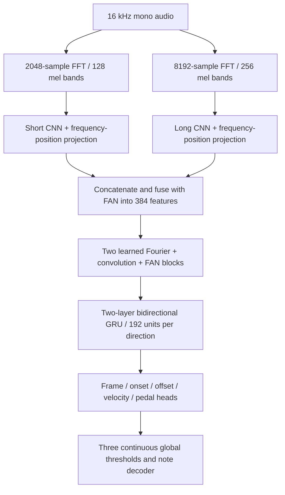

# Version 8 model reference

[Back to the README](../README.md) · [Training commands](../README.md#training)

Paths and commands refer to the project root. Trial results below record the checks performed when V8 was introduced.

V8 has a new recognizer structure. Its default parameter count is approximately **10.01 million**, compared with V7's 1.44 million.



## Structure and parameter budget

| Component | Default structure | Trainable parameters |
| --- | --- | ---: |
| Audio Fourier analysis | Two STFTs with Hann windows, 20 ms hop and full 20–8000 Hz mel coverage; short/long windows are 128/512 ms. | 0 |
| Two CNN encoders | Independent 16 → 32 → 64 → 128 channels with 3×3 convolution, GroupNorm and GELU. Pool frequency only; keep all time frames and absolute frequency positions in the flattened projections. Each branch produces 384 features. | 1,770,432 |
| FAN fusion | Concatenate 768 features, then a FAN projection and normalization into 384 features. | 222,144 |
| Fourier network | Two residual blocks. Each combines a temporal real FFT, learned frequency-domain channel mixing, inverse FFT, local three-frame convolution and a residual FAN projection. | 6,419,328 |
| Recurrence | Two-layer bidirectional GRU, 192 hidden units per direction. | 1,331,712 |
| Output heads and normalization | 88 frame/onset/offset/velocity outputs and one pedal output. Frames depend on onsets; offset refinement depends on frame/onset/pedal activity. | 269,305 |
| Decision parameters | Three bounded scalar cutoffs shared by all keys. | 3 |
| **Total** | **Default V8** | **10,012,924** |

Three FAN layers explicitly learn periodic and aperiodic features: `concat(cos(Wp*x), sin(Wp*x), GELU(Wa*x + ba))`. At width 384, each has 96 cosine outputs, 96 sine outputs and 192 aperiodic outputs. The periodic projection weights are learned, following the [FAN paper](https://arxiv.org/abs/2410.02675) and its [authors' repository](https://github.com/YihongDong/FAN). One FAN layer fuses the two CNN branches; the other two process the residual features inside the Fourier blocks.

The trainable Fourier layers operate on the **time sequence of encoded features**. They retain nine temporal Fourier modes: a real DC matrix and eight complex channel-mixing matrices. This mode limit concerns feature changes over time; the audio encoders still cover all 88 musical pitches. Eight frames of zero padding on each side reduce boundary wraparound; cropping restores the original frame count. Local convolution and residual paths preserve rapid changes, while the GRU provides ordered context. Short/odd clip lengths are supported.

The mixing follows the FFT → learned spectral multiplication → inverse FFT approach described in the [NeuralOperator spectral-convolution guide](https://neuraloperator.github.io/dev/theory_guide/fno.html) and the [original Fourier Neural Operator paper](https://arxiv.org/abs/2010.08895), adapted here to piano feature sequences. This adaptation needs transcription evaluation; results from those papers do not establish accuracy for piano audio. No new package is required: the implementation uses PyTorch FFT operations.

## Checkpoint selection

V8 uses the **same validation system as V7**: ordinary deterministic validation windows, current learned thresholds evaluated once per epoch, the same one-to-one note matching, and the same clip-boundary exclusions. Validation examples do not update thresholds. With the default 32 training windows per file, validation uses 16 fixed four-second windows per recording, across all locally available validation recordings.

Counts are accumulated per key across all validation windows before scoring:

```text
F_beta(pitch) = (1 + beta^2) * TP / ((1 + beta^2) * TP + FP + beta^2 * FN)
pitch F0123 = (pitch F0 + pitch F1 + pitch F2 + pitch F3) / 4
note_macro_f0123 = mean(pitch F0123 across keys with reference notes)
```

Undefined scores are zero. Each supported key has equal weight. F0 measures precision; F1 balances precision/recall; F2 and F3 favor recall. Keys without references are excluded from this macro average; their false positives remain in micro metrics and per-key reports. Exact MIDI pitch must match, onset must be within 50 ms, and offset must be within `max(50 ms, 20% of reference duration)`.

`note_macro_f0123` controls best-checkpoint saving and learning rate reduction. Best is replaced only when this score improves by more than `1e-6`. Early stopping has been removed for all versions: training runs every requested epoch, including when resuming old checkpoints. V7 continues to default to `note_macro_f03`; earlier models keep their existing metrics. V8 reports all four macro scores and the combined average in the console, history and evaluation JSON. CSV adds per-key `f2`, `f0123` and `in_macro_f0123`.

Three global threshold parameters are updated on training batches with a differentiable per-key mean(F0,F1,F2,F3) surrogate, plus empty-key false-activity penalties and prior regularization. Classifier probabilities are detached for the threshold objective. The recognizer uses the supervised losses. V8 now defaults to **60% windows anchored on MIDI 30–68 inclusive / 40% ordinary random windows**, with inverse square-root pitch counts favoring rare focus notes. Normalized error weights are **2 inside MIDI 30–68 and 1 outside** for recognition and threshold learning. All 88 outputs and the validation selection metric remain the same. V7 retains its bass/treble defaults. `calibration=parameters threshold_sets=1` confirms that validation evaluates one current tuple; no grid search runs in V8 training.

The focus controls are `--middle-sampling`, `--middle-min-note`, `--middle-max-note` and `--middle-loss-weight`. Their defaults are 0.6, 30, 68 and 2; V8 bass/treble sampling defaults to zero and edge weight to 1. Older V8 checkpoints without the new sampling field adopt these defaults on resume, unless explicitly overridden. Newly saved checkpoints restore their recorded focus settings. See the [continuation command](../README.md#continue-with-the-refreshed-data-and-focus) for the refreshed training data.

## Size and memory controls

Default V8 requires more computation than V7. `--batch-size 2` reduces training memory without changing parameter count or validation coverage. Use the same `--seconds` and `--windows-per-file` across compared runs. `--feature-width`, `--fourier-modes`, `--fourier-layers`, `--hidden-size`, and `--gru-layers` can change a fresh V8's size; their saved values are restored on resume. The 10.01 million count applies to defaults **384 / 9 / 2 / 192 / 2**. More parameters do not establish better accuracy; a full training run and held-out evaluation are needed.

## Verification and trial checkpoint

At the V8 implementation checkpoint, all **74 tests passed**, including FAN periodic projections, Fourier filtering, short/odd frame lengths, gradients through every branch, the four-score selection criterion, threshold learning, optimizer resume, older-model compatibility, evaluation CSV and app inference. The default model also completed a CUDA forward/backward/AdamW step on the RTX 4050 with a batch of four four-second clips. PyTorch's peak allocated memory in that process was about 473 MiB and reserved memory 560 MiB; these figures exclude other processes and CUDA driver/library memory. This checks execution and capacity; the first batch's timing is not a steady-state benchmark. Details are in `diagnostics/v8-architecture.json`.

A one-epoch CPU trial used 41 training windows across 41 recordings and one fixed window for each of 16 validation recordings. It successfully saved and reloaded the full FAN model and updated all three continuous thresholds. `checkpoints/piano-v8-trial.pt` and `.last.pt` can be selected in the app for a pipeline preview. This starts from random weights and has received only 11 training batches, so recognition remains poor; use the [V8 training command](../README.md#start-a-new-run) before judging accuracy. The trial uses fewer validation windows than a normal run. Its settings, scores and thresholds are in `diagnostics/v8-trial.json`.
